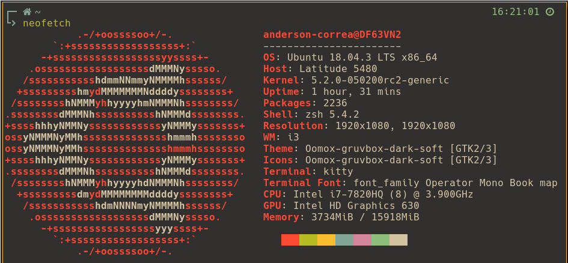

# my-dotfiles

Config para o ambiente linux com o tema solarized light

# fontes utilizadas
Hack e Hack Nerd Font
awesome-fontconfig

# dependências necessárias

zsh  
oh-my-zsh  
sdkman  
i3-gaps  
polybar  
rofi  
i3lock  
feh  
scrot  
i3lock-multimonitor  
compton  
mopidy  
ncmpcpp  
mpc  
zscroll  
cava  
pavucontrol  
tty-clock  
kitty (terminal)   
xserver-xorg-input-all (Ubuntu - para utilizar o synclient para gerenciar o touchpad)  
